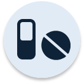
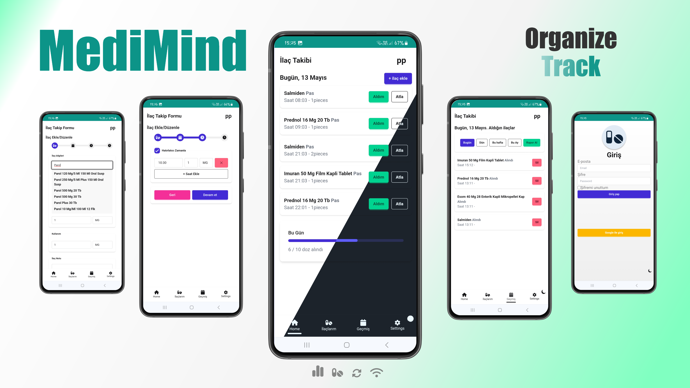
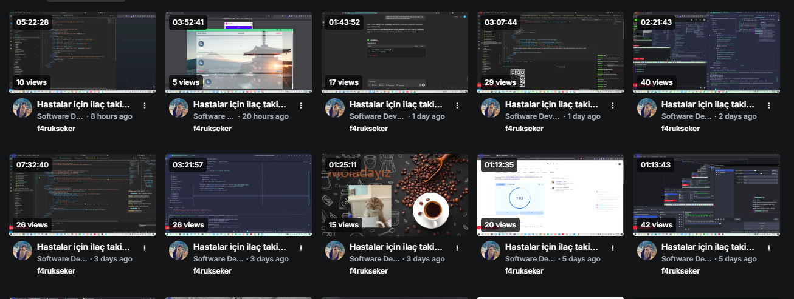
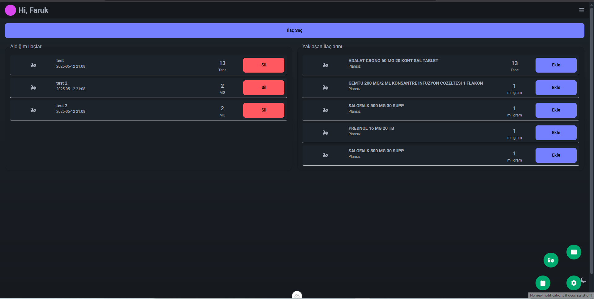
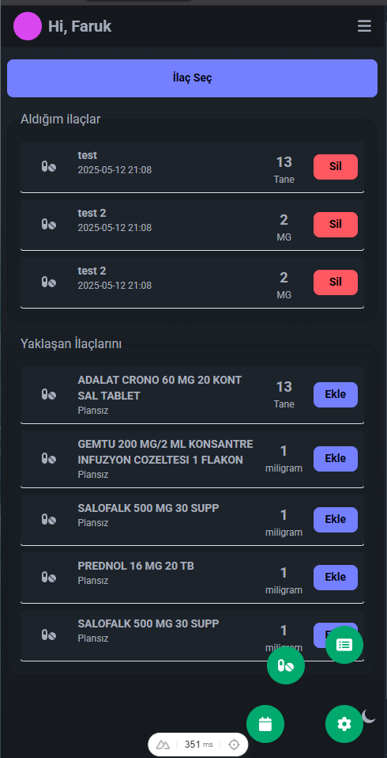
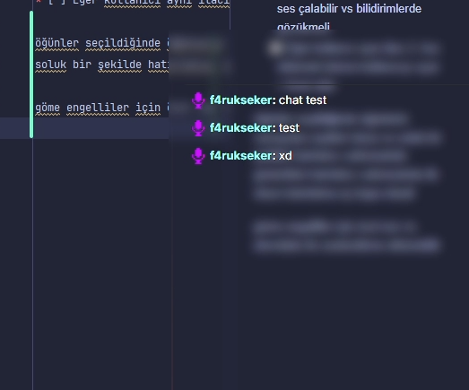

# 💊 MediMind

**Açık kaynaklı, hasta odaklı ilaç takip ve hatırlatma uygulaması.**  
Karmaşık senaryoları desteklemek için tasarlandı: farklı dozlar, değişken tedavi süreleri, doktor notları, uyarılar ve daha fazlası.

- Geliştirme süreci : devam ediyor
- Tamamlanan görev oranı : 63.4%




---

## 🚀 Özellikler

- Zamanlanmış ilaç hatırlatıcılar
- Dozaj kontrolü ve alım takibi
- Sesli/görsel bildirimler
- Gelişmiş tedavi planları (örn: "haftada 3 gün", "1 hafta al 1 hafta verme" vb.)
- Hasta yakını veya doktor paylaşımı
- Offline mod desteği
- Açık kaynaklı, özelleştirilebilir altyapı

---

## 🎥 Canlı Geliştirme

Proje gelişimini [Kick kanalımda](https://kick.com/f4rukseker) canlı olarak takip edebilirsin.  
Kod, tasarım kararları, hata ayıklama süreçleri ve daha fazlası gerçek zamanlı olarak paylaşılıyor.

---

## 🛠️ Kurulum

```bash
git clone https://github.com/kullaniciadiniz/medimind.git
cd medimind
npm install
npm run dev
````

> Not: Backend için ayrı kurulum talimatları `backend/README.md` dosyasında.

---

## 💡 Neden Bu Proje?

Hasta ya da hasta yakını olarak doğru zamanlamayla ilaç almak kritik.
Piyasadaki çözümler yetersiz ya da kapalı kaynaklı. Bu proje, sürdürülebilir ve topluluk destekli bir çözüm sunmayı hedefliyor.

---

## 📌 Yol Haritası

* [x] Temel hatırlatma sistemi
* [x] Offline desteği
* [ ] Kullanıcı rollerine göre senaryolar
* [ ] Bildirim sisteminde yapay zeka önerileri
* [ ] Doktorlara özel panel
* [ ] PWA olarak dağıtım

---

## 🤝 Katkı Sağla

Pull request'ler, issue'lar ve öneriler memnuniyetle karşılanır.
Lütfen önce `CONTRIBUTING.md` dosyasını incele.

---

## 📝 Lisans

Bu proje [GNU AFFERO GENERAL PUBLIC LICENSE Version 3](LICENSE) ile lisanslanmıştır.

---

## 📱 Demo ve Görseller






---

## 📧 İletişim

* Kick: https://kick.com/f4rukseker
* E-posta: [info@farukseker.com.tr](mailto:info@farukseker.com.tr)


